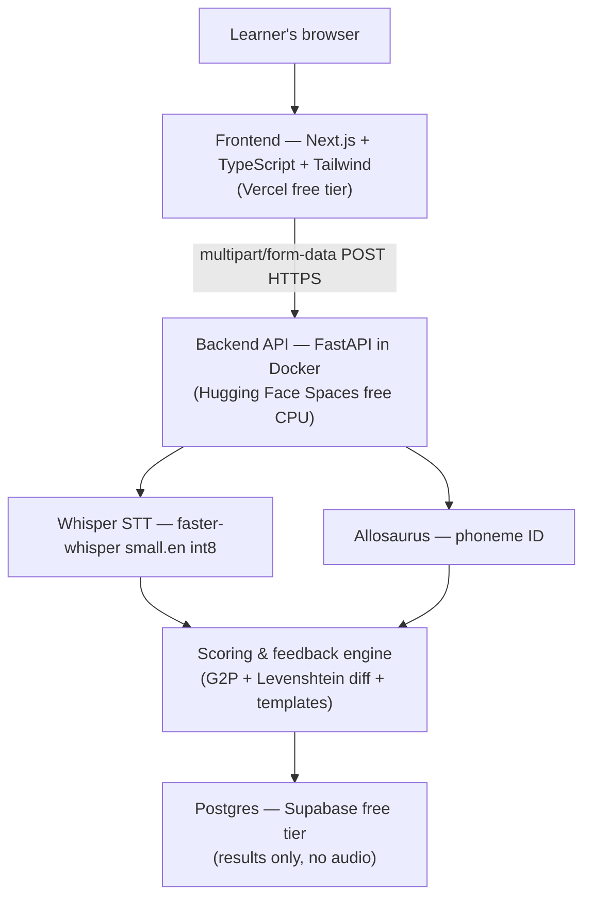

# Architecture — Pronunciation Coach Backend

## System overview

## Components

### Frontend (separate repo)

Next.js app deployed on Vercel. Handles consent, recording/upload, client-side duration validation (30–45s), and results display with word-level highlights.

### Backend API (this repo)

FastAPI server packaged as Docker for Hugging Face Spaces. Validates uploads, orchestrates the scoring pipeline in-process, persists only structured results, and deletes temp audio immediately.

### Whisper STT (`faster-whisper`)

- Model: `small.en`, int8 quantized for CPU
- Outputs: transcript, word-level timestamps, per-word confidence
- Low confidence → "unclear segment" flag
- Language detection: rejects non-English input

### Allosaurus phoneme recognizer

- Universal open-source phone recognizer (`pip install allosaurus`)
- Audio sliced per Whisper word boundary; phonemes recognized per segment
- Produces actual spoken phoneme sequence (approximate GOP-style ground truth)

### g2p_en (CMU Pronouncing Dictionary)

- Converts each transcript word to **expected** IPA phoneme sequence
- Offline, no API calls

### Scoring & feedback engine

Pure Python, in-process:

1. **G2P** — expected phonemes per word
2. **Diff** — Levenshtein edit distance between expected and actual phonemes
   - substitution → mispronunciation
   - deletion → omission
   - insertion → insertion
   - low Whisper confidence → unclear segment
3. **Score** — `word_score = 100 × (1 − edit_distance / expected_length)`; overall = 70% accuracy + 30% fluency (WPM + pause gaps)
4. **Feedback** — 35-entry curated confusion-pair table (θ→s, v→w, r→l, etc.); generic fallback otherwise. Optional Gemini rephrase if `GEMINI_API_KEY` is set (cosmetic only).

### Postgres (Supabase)

Stores: `session_id`, transcript, word-level scores JSON, overall score, consent flag, `created_at`, `retention_expiry_at`. **Never raw audio.**

## Why this stack

| Choice | Reason |
|--------|--------|
| Whisper + Allosaurus + rule-based diffing | Deliberate $0 trade-off vs Azure/Google commercial pronunciation APIs. We approximate Goodness-of-Pronunciation (GOP) from two open models + edit distance. **Scoring is noticeably rougher** than a calibrated commercial API, but fully reproducible with zero cost. |
| Allosaurus over raw wav2vec2 CTC | Packaged universal phone recognizer with simple Python API — same "don't reinvent it" logic as a managed API, at zero cost. |
| Hugging Face Spaces over Render/Railway | Self-hosted speech models need ~16 GB RAM (HF free CPU tier) vs ~512 MB on typical PaaS free tiers — difference between working and OOM on every request. |
| FastAPI over Flask | Async support for sequential model calls per request. |
| Next.js + TypeScript | Recorder UI, client validation, word-level highlight results view. |
| Supabase Postgres | Structured results only; data minimization. Mumbai (`ap-south-1`) region recommended for India data residency. |

## Scoring decisions (GOP-style diff)

For each word `w` with Whisper boundaries `[start, end]`:

1. Expected phonemes `E` from g2p_en
2. Actual phonemes `A` from Allosaurus on audio slice `[start, end]`
3. Edit distance `d = Levenshtein(E, A)`
4. `accuracy = 100 × (1 − d / |E|)` (clamped 0–100)
5. First edit operation determines `error_type` and template feedback
6. If Whisper word confidence < 0.35 → force "unclear"
7. Fluency sub-score from words-per-minute (ideal 100–170) minus pause penalties (>0.8s gaps)

## DPDP Act 2023 compliance

| Principle | Implementation |
|-----------|----------------|
| **Consent** | Modal before record/upload; `POST /api/consent` stores boolean + timestamp on session UUID |
| **Data minimization** | No account, email, or name; random UUID only; audio never persisted |
| **Purpose limitation** | Audio used only for that request's scoring; stated in consent text |
| **Storage limitation** | 30-day retention (`retention_expiry_at`); hourly background purge in `services/retention.py` |
| **Right to erasure** | `DELETE /api/results/{id}` + UI "Delete my results" button |
| **Data residency** | Self-hosted on HF Space (configure region at Space creation); Supabase project in **Mumbai (ap-south-1)** recommended |
| **Security** | HTTPS end-to-end; Supabase encrypts at rest by default; no raw audio or transcript in logs |
| **No third-party sharing** | Audio and transcript never leave your containers — stronger than paid-API architectures |

## Trade-offs

**Primary trade-off: scoring accuracy for zero cost.**

Commercial APIs (Azure Pronunciation Assessment, ELSA) return calibrated phoneme-level GOP scores trained on millions of learner utterances. Our pipeline chains two general-purpose models with a heuristic diff — it will:

- Miss subtle articulation errors
- Over-penalize accent variation
- Produce noisier phoneme alignments on fast or mumbled speech

This is **deliberate and documented**, not accidental. A working, honest $0 pipeline is a stronger deliverable than an untested claim of parity.

**What we'd build next with more time:**

- Small fine-tuned scorer on labeled learner audio (L2-ARCTIC, etc.)
- Phoneme-level IPA visualization with mouth diagrams
- Multi-accent reference support (US/UK/IN)
- Real-time streaming scoring via WebSocket
- Confidence-calibrated score normalization against a labeled dev set

## Optional Gemini polish

If `GEMINI_API_KEY` is set, templated feedback is rephrased via Google's free tier (Google AI Studio). The app **must and does** run correctly with this unset — templates are the real feedback mechanism.
